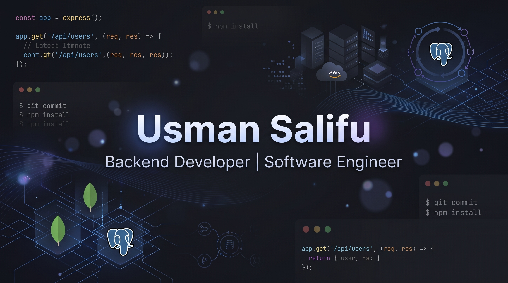

  

# Hi, I'm Usman Salifu

Computer Science student and backend developer building REST APIs and backend systems.

I'm currently learning cloud computing, Linux, PostgreSQL, C++, Python, and DevOps.

## About Me

I'm a Computer Science student interested in backend development, cloud computing, and DevOps.

## Languages and Tools

## GitHub Stats

## Featured Projects

### Sustainability Marketplace
Online marketplace for sustainable products, similar to Jumia.

[View Project](https://github.com/usmansalifu34-pixel/sustainability-marketplace)

### Assignment Tracker API
API designed to track students' assignments.

[View Project](https://github.com/usmansalifu34-pixel/Assignment-tracker-API-Shocker-)

## Currently Learning

- C++
- Python
- PostgreSQL
- AWS
- Linux
- DevOps

## Connect with me

